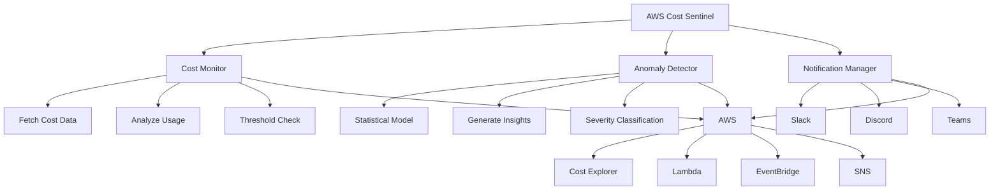

# AWS Cost Sentinel

<div align="center">


**Stop AWS bill surprises. Get instant alerts when your costs spike.**

*"Saved our startup $4,500 in the first month"* - Real user

[Quick Install](#-quick-start) • [Features](#-features) • [Demo](#-demo) • [Documentation](#-documentation)

</div>

---

## 🎯 What is AWS Cost Sentinel?

AWS Cost Sentinel is an intelligent, ML-powered cost monitoring system that watches your AWS spending 24/7 and alerts you the moment something looks off. No more surprise bills. No more manual spreadsheets.

### The Problem

- 💸 **Unexpected AWS bills** can kill startups
- 📊 **Manual cost tracking** is time-consuming and error-prone
- 🚨 **Cost spikes** go unnoticed until it's too late
- 🔍 **Service-level insights** are buried in complex dashboards

### The Solution

AWS Cost Sentinel automates cost monitoring with:
- ✅ **ML-based anomaly detection** - Catches unusual spending patterns automatically
- ✅ **Real-time alerts** - Microsoft Teams, Slack, Discord, or email notifications when costs spike
- ✅ **Daily summaries** - Know your spending every morning
- ✅ **Service breakdowns** - See exactly which AWS services cost the most
- ✅ **Budget tracking** - Set thresholds and get warned before you exceed them
- ✅ **Serverless deployment** - Runs on AWS Lambda, costs pennies per month

---

## 🚀 Features

### 📈 Intelligent Monitoring

- **Daily Cost Tracking** - Automatic monitoring of AWS costs across all services
- **Service-Level Breakdown** - Identify your top spending services at a glance
- **Trend Analysis** - Compare today vs yesterday vs last week
- **Budget Thresholds** - Set daily, weekly, and monthly limits

### 🤖 ML-Powered Anomaly Detection

- **Automatic Anomaly Detection** - Statistical methods (Modified Z-Score / MAD) identify unusual spending patterns
- **Configurable Sensitivity** - Low, medium, or high sensitivity levels
- **Historical Analysis** - Learns from your spending patterns
- **Smart Alerts** - Only alerts on statistically significant anomalies
- **Zero heavy dependencies** - Pure Python stdlib implementation, no numpy/pandas/sklearn needed

### 📢 Multi-Channel Notifications

- **Microsoft Teams Integration** - Webhook-based notifications with embeds
- **Slack Integration** - Rich formatted alerts with charts and breakdowns
- **Discord Integration** - Webhook-based notifications with embeds
- **Email Support** - AWS SES integration for email alerts
- **SNS Support** - Integrate with existing AWS SNS topics
- **Severity Levels** - Critical, high, medium, low alert classification

### ⚙️ Flexible Deployment

- **AWS Lambda** - Serverless, runs on schedule (cron-based)
- **Local Execution** - Run manually or via cron on any server
- **Docker Support** - Containerized deployment option
- **Easy Configuration** - YAML-based config with environment variables

---

## 📸 Demo

### Slack Alert Example
```
🚨 AWS Cost Alert: Budget Threshold

Alert Type: Daily Budget
Severity: HIGH
Current Cost: $127.50
Threshold: $100.00

• Period: Daily
• Percent of Budget: 127%
• Previous Day: $45.30
```

### Daily Summary Example
```
📊 AWS Daily Cost Summary

Today: $87.42          | Yesterday: $76.31
This Week: $523.18     | This Month: $1,847.56
Daily Change: 📈 +14.6% | Avg Daily: $74.22

Top Services (7 days):
1. EC2: $234.56
2. RDS: $156.78
3. S3: $89.43
4. Lambda: $42.41
5. CloudWatch: $15.20

⚠️ Warnings:
⚠️ Daily: 127% of budget
```

---

## 🏁 Quick Start

### Prerequisites

- Python 3.9 or higher
- AWS Account with Cost Explorer API enabled
- AWS credentials configured

### Installation

```bash
# Clone the repository
git clone https://github.com/ahmad0303/aws-cost-sentinel.git
cd aws-cost-sentinel

# Create and activate virtual environment
python -m venv venv

# On Linux/Mac:
source venv/bin/activate
# On Windows (Git Bash / MINGW64):
source venv/Scripts/activate
# On Windows (CMD):
venv\Scripts\activate

# Install runtime dependencies
pip install -r requirements.txt

# Install dev dependencies (includes boto3, pytest, moto, linting tools)
pip install -r requirements-dev.txt

# Copy configuration template
cp config.yaml.example config.yaml
cp .env.example .env

# Edit configuration
nano config.yaml    # Linux/Mac
notepad config.yaml # Windows
```

> **Why two requirements files?**
>
> | File | What's in it | When to install |
> |------|-------------|-----------------|
> | `requirements.txt` | Runtime deps — notifications (slack-sdk, discord-webhook, pymsteams), config (pyyaml, python-dotenv), etc. | Always |
> | `requirements-dev.txt` | Dev/test deps — **boto3**, pytest, moto, black, flake8, mypy | Local development & testing |
>
> `boto3` is in `requirements-dev.txt` because AWS Lambda already includes it. Keeping it out of `requirements.txt` makes the Lambda deployment package smaller. **For local development, you must install both files.**

### Quick Start Script

Alternatively, use the quick start script which handles everything automatically:

```bash
chmod +x quick_start.sh
./quick_start.sh
```

### Configuration

1. **Edit `config.yaml`** - Set your budget thresholds and preferences
2. **Edit `.env`** - Add your Teams/Slack/Discord webhook URLs and AWS credentials
3. **Run initial test**:

```bash
python -m src.sentinel
```

### Deploy to AWS Lambda

```bash
# Set your Lambda role ARN
export LAMBDA_ROLE_ARN=arn:aws:iam::YOUR_ACCOUNT:role/YOUR_ROLE

# Deploy
chmod +x deployment/deploy.sh
./deployment/deploy.sh
```

That's it! The sentinel will now run daily at 9 AM UTC and send you reports.

---

## 📚 Documentation

### Configuration Guide

#### Budget Thresholds

```yaml
monitoring:
  budgets:
    daily_max: 100.0      # Alert if daily cost exceeds $100
    weekly_max: 500.0     # Alert if weekly cost exceeds $500
    monthly_max: 2000.0   # Alert if monthly cost exceeds $2000
```

#### Anomaly Detection

```yaml
anomaly_detection:
  enabled: true
  sensitivity: medium  # low, medium, or high
  min_history_days: 7  # Minimum days of data needed
  contamination: 0.1   # Expected % of anomalies (0.05 - 0.15)
```

#### Notifications

```yaml
notifications:
  teams:
    enabled: true
    webhook_url: ${TEAMS_WEBHOOK_URL}

  slack:
    enabled: true
    webhook_url: ${SLACK_WEBHOOK_URL}
    channel: "#aws-costs"
    mention_on_critical: "@channel"
  
  discord:
    enabled: true
    webhook_url: ${DISCORD_WEBHOOK_URL}
    mention_on_critical: "@everyone"
```

### Usage Examples

#### Run Monitoring Cycle

```bash
# Run a complete monitoring cycle
python -m src.sentinel

# Use custom config file
python -m src.sentinel /path/to/config.yaml
```

#### CLI Commands
```bash
# Show status
python sentinel_cli.py status

# View costs
python sentinel_cli.py costs --days 30 --service

# Detect anomalies
python sentinel_cli.py anomalies

# Send report
python sentinel_cli.py report

# Forecast
python sentinel_cli.py forecast --days 30
```

---

## 🏗️ Architecture



---

## 🐳 Deployment Options

### Option 1: AWS Lambda (Recommended)
```bash
# Set your Lambda role ARN (from Step 2 of AWS Setup)
export LAMBDA_ROLE_ARN=arn:aws:iam::YOUR_ACCOUNT_ID:role/AWSCostSentinelRole

# Optional: Set custom function name
export LAMBDA_FUNCTION_NAME=aws-cost-sentinel

# Set AWS region
export AWS_REGION=us-east-1

# Make deployment script executable
chmod +x deployment/deploy.sh

# Run deployment
./deployment/deploy.sh

# Add env vars to Lambda directly:
aws lambda update-function-configuration \
    --function-name aws-cost-sentinel \
    --region eu-west-1 \
    --environment "Variables={DISCORD_WEBHOOK_URL=https://discord.com/api/webhooks/YOUR_ACTUAL_URL_HERE}"
```

### Option 2: Docker
```bash
docker build -t aws-cost-sentinel .
docker run --env-file .env aws-cost-sentinel
```

### Option 3: Local/Cron
```bash
# Add to crontab
0 9 * * * cd /path/to/aws-cost-sentinel && python -m src.sentinel
```

---

## 🔐 AWS IAM Permissions

Required IAM permissions for Lambda execution role:

```json
{
  "Version": "2012-10-17",
  "Statement": [
    {
      "Effect": "Allow",
      "Action": [
        "ce:GetCostAndUsage",
        "ce:GetCostForecast"
      ],
      "Resource": "*"
    },
    {
      "Effect": "Allow",
      "Action": [
        "logs:CreateLogGroup",
        "logs:CreateLogStream",
        "logs:PutLogEvents"
      ],
      "Resource": "arn:aws:logs:*:*:*"
    }
  ]
}
```

Optional (for SNS notifications):
```json
{
  "Effect": "Allow",
  "Action": [
    "sns:Publish"
  ],
  "Resource": "arn:aws:sns:*:*:aws-cost-alerts"
}
```

---

## 🧪 Testing

```bash
# Install ALL dependencies (both files required for testing)
pip install -r requirements.txt
pip install -r requirements-dev.txt

# Run tests
pytest tests/ -v

# Run with coverage
pytest tests/ --cov=src --cov-report=html

# Lint & format
flake8 src
black --check src
mypy src --ignore-missing-imports
```

### Test Coverage
- Core monitoring: ✅ Fully tested
- Anomaly detection: ✅ Fully tested
- Configuration: ✅ Fully tested
- Notifications: ✅ Integration ready

---

## 💡 Use Cases

### Startup Cost Control
- Monitor AWS spending as you scale
- Catch runaway resources before they drain your runway
- Daily cost visibility for the entire team

### Enterprise FinOps
- Department-level cost tracking
- Anomaly detection across multiple accounts
- Automated reporting for finance teams

### Development Teams
- Track costs per environment (dev, staging, prod)
- Identify expensive experiments early
- Budget awareness without constant AWS Console checking

---

## 🤝 Contributing

Contributions are welcome! Please feel free to submit a Pull Request.

1. Fork the repository
2. Create your feature branch (`git checkout -b feature/AmazingFeature`)
3. Install both dependency files:
   ```bash
   pip install -r requirements.txt
   pip install -r requirements-dev.txt
   ```
4. Run tests before committing: `pytest tests/ -v`
5. Commit your changes (`git commit -m 'Add some AmazingFeature'`)
6. Push to the branch (`git push origin feature/AmazingFeature`)
7. Open a Pull Request

---

## 📝 License

This project is licensed under the MIT License - see the [LICENSE](LICENSE) file for details.

---

## 🙏 Acknowledgments

- Built with [boto3](https://github.com/boto/boto3) - AWS SDK for Python
- Anomaly detection powered by Modified Z-Score (MAD-based) — pure Python, no heavy ML libraries
- Slack integration via [slack-sdk](https://github.com/slackapi/python-slack-sdk)

---

## 📞 Support

- 🐛 [Report a bug](https://github.com/ahmad0303/aws-cost-sentinel/issues)
- 💡 [Request a feature](https://github.com/ahmad0303/aws-cost-sentinel/issues)
- 📖 [Read the docs](https://github.com/ahmad0303/aws-cost-sentinel/wiki)

---

<div align="center">

**⭐ Star this repo if AWS Cost Sentinel saved you money! ⭐**

Made with ❤️ by developers who hate surprise AWS bills

</div>